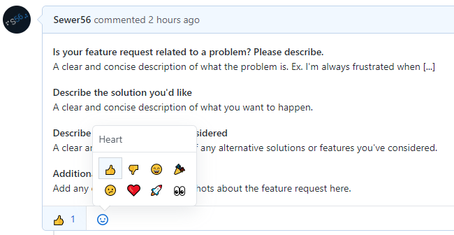

	
	 
	<strong>Getting Started</strong> 

## Submitting Issues & Suggestions

In order to get started with submitting issues and reports, click the `Issues` button at the top of the web page; then proceed to select the `New Issue` button.

1.

2.

Then select a template from a given list of available templates.

To learn how to format/style your posts, feel free to look at your nearby [Markdown Cheat Sheet](https://github.com/adam-p/markdown-here/wiki/Markdown-Cheatsheet).

## Vote on Issues

You can voice your pleasement or displeasement at individual issues and suggestions by reacting to them.

Reacting to issues is highly encouraged, it allows the dev team to prioritize issues to be fixed for future versions.