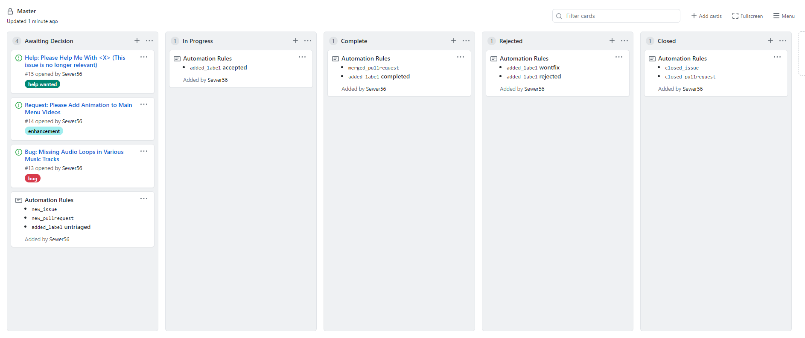
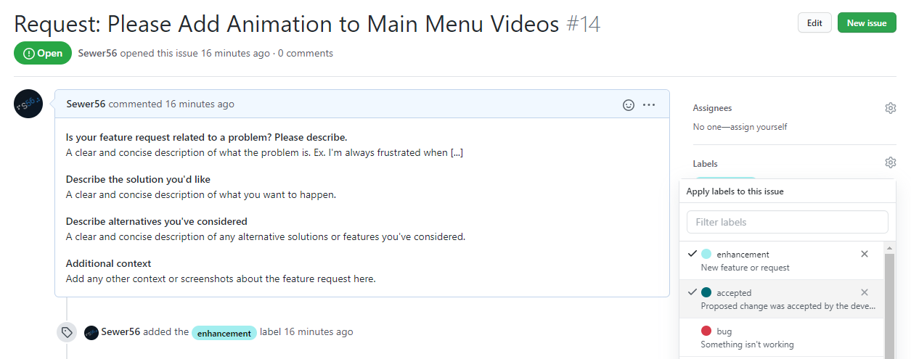
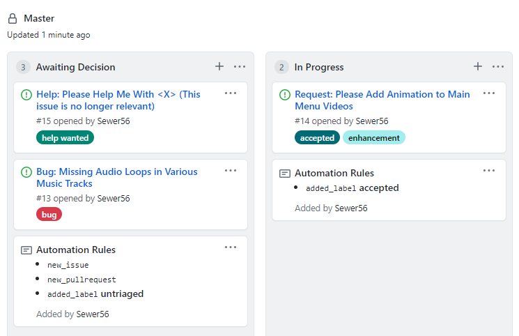
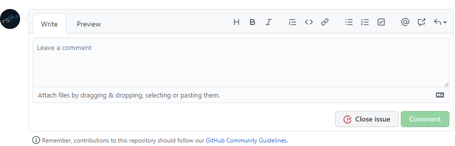
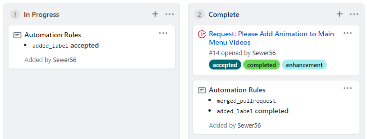

	
	 
	<strong>Developer Workflow</strong> 

# Introduction

This repository uses a Kanban development method to make it easier to track tasks for future ROM versions. You might be familiar with this if you ever have used an application like Trello or Sticky Notes for project management. 

Issues are separated into the following categories:

- **Awaiting Decision:** Active proposals from the community.
- **In Progress:** Issues picked up to be fixed by the dev. team.
- **Complete:** Issues resolved by the dev. team (fixed in current version).
- **Rejected:** Proposals that were rejected by the community and/or dev team.
- **Closed:** Issues that are no longer relevant or have lost to a competing issue/proposal.

Discussion topics are not tracked.
The board is completely automated and managed by a bot.

## Promoting Issues

To promote an issue, simply assign the `accepted` label to an individual issue as follows:

(Click labels and tick `accepted`).

Once performed, a bot will automatically move the request to the **In Progress** category.

This should be only performed for issues that were accepted by both developers and the community. Ideally, no amendments should be made to issues once approved.

Remember that this is a community project, do not promote controversial issues with overwhelmingly negative opinion.

## Completing Issues

In order to mark the issue as completed, first **close** the issue and then assign the `completed` label to an individual issue:

The result is that the issue will be moved to the **Complete** category:

Please only perform this action once the solution has been integrated into the ROM/DOL. 

Note: At the moment, this repository does not track mod development itself (i.e. DOL and mod code). As such, pull requests wouldn't be accepted for anything outside of documentation.

## Rejecting & Closing Issues

To reject an issue, set the `rejected` label on an issue. 
In order to close an issue, either a developer or the original issue poster can press the **close** button.

In order to avoid upset, issues should only be *rejected* upon reaching a consensus by the developers and the community. Extremely low quality issues should be rejected on sight.

The close button should be used if and only if the issue is no longer relevant, the submitter does not think it is an issue anymore or the issue has lost to a competing issue/proposal.