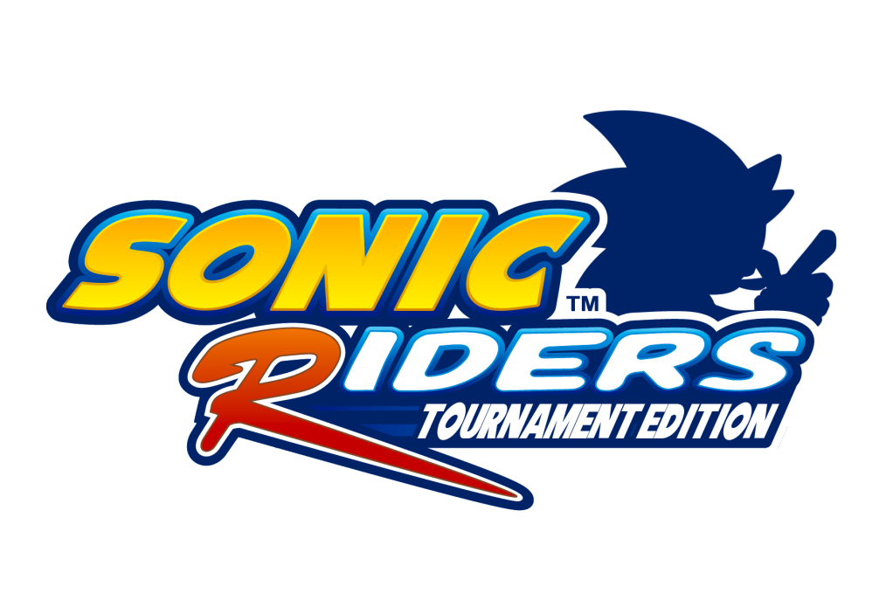

	
	 
	<strong>Sonic Riders Tournament Edition</strong> 
    
Issue Tracker

# About

This is the official issue tracker for "Sonic Riders Tournament Edition", a community mod that "gears" the game towards competitive play; built on the belief that Sonic Riders was a sorely misunderstood game, and that it's in-depth mechanics and skill ceiling actually have competitive potential as a competitive game. 

This  tracker is used by the community to suggest possible changes to the mod, general discussion as well as by the developers to keep track of features to be added in future versions of the mod.

- **Discord URL:** https://discord.gg/Hm2Mb2r
- **YouTube:** https://www.youtube.com/channel/UC7-Y78LtYwtrNY8AdFGonew

## Resources
- [Getting Started](./Docs/SubmittingIssues.md)
- [Getting Started (Developers)](./Docs/Workflow.md)